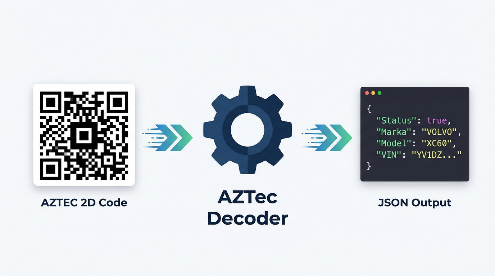

# Dekoder Kodu AZTEC 2D z Dowodu Rejestracyjnego dla Rust

[](https://crates.io/crates/aztec-decoder)
[](https://docs.rs/aztec-decoder)
[](LICENSE)

Oferujemy Państwu usługę Web API pozwalającą zdekodować dane z kodu AZTEC 2D zapisanego w dowodach rejestracyjnych pojazdów samochodowych.



Nasza biblioteka dekoduje dane z dowodu rejestracyjnego, zapisane w postaci kodu obrazkowego tzw. kod aztec. Dekodowane są wszystkie wymienione pola w dowodzie rejestracyjnym pojazdu.

https://www.pelock.com/pl/produkty/dekoder-aztec


## Szybki start

```bash
cargo add aztec-decoder
```

Paczka dostępna na https://crates.io/crates/aztec-decoder

```rust
use aztec_decoder::AZTecDecoder;

#[tokio::main]
async fn main() -> Result<(), Box<dyn std::error::Error>> {
    let decoder = AZTecDecoder::new("ABCD-ABCD-ABCD-ABCD");

    let result = decoder.decode_image_from_file("zdjecie-dowodu.jpg").await?;

    if result["Status"] == true {
        println!("{}", serde_json::to_string_pretty(&result)?);
    }

    Ok(())
}
```

---

## Wymagania

- **Rust >= 1.63** (edycja 2021)
- Zależności: [`reqwest`](https://crates.io/crates/reqwest), [`serde_json`](https://crates.io/crates/serde_json), [`thiserror`](https://crates.io/crates/thiserror), [`tokio`](https://crates.io/crates/tokio)

## API

### `AZTecDecoder::new(api_key)`

Tworzy nową instancję dekodera.

| Parametr  | Typ                  | Opis                    |
|-----------|----------------------|-------------------------|
| `api_key` | `impl Into<String>`  | Klucz do usługi Web API |

### `decoder.decode_image_from_file(path)`

Dekoduje kod AZTEC 2D bezpośrednio ze zdjęcia (PNG/JPG).

| Parametr | Typ               | Opis                         |
|----------|--------------------|------------------------------|
| `path`   | `impl AsRef<Path>` | Ścieżka do pliku graficznego |

**Zwraca:** `Result<Value, AZTecError>`

### `decoder.decode_text(text)`

Dekoduje kod AZTEC 2D z odczytanego ciągu znaków (np. ze skanera).

| Parametr | Typ    | Opis                                    |
|----------|--------|-----------------------------------------|
| `text`   | `&str` | Odczytana wartość kodu AZTEC 2D (ASCII) |

**Zwraca:** `Result<Value, AZTecError>`

### `decoder.decode_text_from_file(path)`

Dekoduje kod AZTEC 2D z pliku tekstowego.

| Parametr | Typ               | Opis                        |
|----------|--------------------|-----------------------------|
| `path`   | `impl AsRef<Path>` | Ścieżka do pliku tekstowego |

**Zwraca:** `Result<Value, AZTecError>`

### Typy błędów – `AZTecError`

| Wariant        | Opis                                                    |
|----------------|---------------------------------------------------------|
| `EmptyApiKey`  | Klucz API jest pusty                                    |
| `FileRead`     | Nie udało się odczytać pliku (zawiera `std::io::Error`) |
| `Request`      | Błąd komunikacji HTTP (zawiera `reqwest::Error`)        |
| `InvalidJson`  | Odpowiedź nie jest poprawnym JSON-em                    |

## Użycie

```rust
use aztec_decoder::AZTecDecoder;

#[tokio::main]
async fn main() -> Result<(), Box<dyn std::error::Error>> {
    // inicjalizuj dekoder (używamy naszego klucza licencyjnego do inicjalizacji)
    let decoder = AZTecDecoder::new("ABCD-ABCD-ABCD-ABCD");

    //
    // 1. Dekoduj dane bezpośrednio z pliku graficznego, zwróć wynik jako strukturę JSON
    //
    let result_image = decoder
        .decode_image_from_file(r"C:\zdjecie-dowodu.jpg")
        .await?;

    // czy udało się zdekodować dane?
    if result_image["Status"] == true {
        // wyświetl rozkodowane dane (są zapisane jako struktura JSON)
        println!("{}", serde_json::to_string_pretty(&result_image)?);
    }

    //
    // 2. Dekoduj dane bezpośrednio z pliku graficznego i zwróć wynik jako strukturę JSON
    //
    let result_png = decoder
        .decode_image_from_file(r"C:\zdjecie-kodu-aztec-2d.png")
        .await?;

    println!("{}", serde_json::to_string_pretty(&result_png)?);

    //
    // 3. Dekoduj dane z odczytanego już ciągu znaków (np. wykorzystując skaner ręczny)
    //
    // zakodowane dane z dowodu rejestracyjnego
    let sz_value = "ggMAANtYAAJD...";

    let result_text = decoder.decode_text(sz_value).await?;

    println!("{}", serde_json::to_string_pretty(&result_text)?);

    //
    // 4. Dekoduj dane z odczytanego już ciągu znaków zapisanego w pliku
    //    (np. wykorzystując skaner ręczny)
    //
    let result_file = decoder
        .decode_text_from_file(r"C:\odczytany-ciag-znakow-aztec-2d.txt")
        .await?;

    println!("{}", serde_json::to_string_pretty(&result_file)?);

    Ok(())
}
```

## Gdzie znajdzie zastosowanie Dekoder AZTec?

Dekoder AZTec może przydać się firmom i instytucjom, które pragną zautomatyzować proces ręcznego wprowadzania danych z dowodów rejestracyjnych i zastąpić go poprzez wykorzystanie naszej biblioteki programistycznej, która potrafi rozpoznać i rozkodowac kody AZTEC 2D bezpośrednio ze zdjęć dowodów rejestracyjnych lub zeskanowanych już kodów (wykorzystując skaner QR / AZTEC 2D).


## Dostępne edycje programistyczne

Dekoder AZTec dostepny jest w trzech edycjach. Każda wersja posiada inne cechy i inne możliwości dekodowania. Wersja oparta o Web API jako jedyna posiada możliwość rozpoznawania i dekodowania danych bezpośrednio ze zdjęć i obrazków. Pozostałe wersje do dekodowania wymagają już odczytanego kodu w postaci tekstu (np. ze skanera).

## Porównanie edycji


| Cechy                                             | Web API | Źródła | Binaria |
|---------------------------------------------------|---------|--------|---------|
|  Dekodowanie danych ze zdjęć i obrazków (PNG/JPG) | ✅      | ❌    | ❌ |
|  Dekodowanie danych z zeskanowanych kodów (tekst) | ✅      | ✅    | ✅ |
|  Kody źródłowe algorytmu dekodującego             | ❌      | ✅    | ❌ |
|  Przykłady użycia                                 | ✅      | ✅    | ✅ |
|  Format wyjściowy JSON                            | ✅      | ✅    | ✅ |
|  Format wyjściowy XML                             | ❌      | ✅    | ✅ |
|  Wymagane połączenie z Internetem                 | ✅      | ❌    | ❌ |
|  Licencja wieczysta                               | ❌      | ✅    | ✅ |
|  Darmowe aktualizacje                             | ✅      | ✅    | ✅ |
|  Darmowe wsparcie techniczne                      | ✅      | ✅    | ✅ |

### Wersja Web API

Jest to najbardziej zaawansowana edycja Dekodera AZTec, ponieważ umożliwia precyzyjne rozpoznawanie i dekodowanie kodów AZTEC 2D bezpośrednio ze zdjęć oraz obrazków zapisanych w formatach PNG lub JPG.

Algorytm rozpoznawania obrazu należy do naszej firmy, jest to innowacyjne rozwiązanie rozwijane od podstaw przez prawie rok czasu.

Rozumiemy potrzeby naszych klientów oraz problemy wynikające z rozpoznawnia rzeczywistych zdjęć kodów AZTEC 2D znajdujących się w dowodach rejestracyjnych, które nie zawsze są idealnie wykonane, czy to ze względu na rodzaj aparatu, kąta wykonania zdjęcia, refleksów czy słabej rozdzielczości.

Przy tworzeniu naszego rozwiązania wzieliśmy wszystkie te czynniki pod uwagę i w efekcie nasz algorytm radzi sobie znakomicie z rozpoznawaniem kodów AZTEC 2D ze zdjęć z wszelkiego rodzaju zniekształceniami, uszkodzeniami i niedoskonałościami. Znacznie przewyższa pod względem funkcjonowania dostępne na rynku biblioteki rozpoznawnia kodów AZTEC 2D takie jak np. ZXing.

## Gotowe paczki dla innych języków programowania

Dla ułatwienia szybkiego wdrożenia, paczki instalacyjne Dekodera AZTec zostały wgrane na repozytoria dla kilku popularnych języków programowania, a dodatkowo ich kody źródłowe zostały opublikowane na GitHubie:

| Repozytorium | Język | Instalacja | Paczka | GitHub |
| ------------ | ----- | ---------- | ------ | ------ |
|  | Java | Dodaj wpis do pliku `pom.xml`<br />`<dependency>`<br />`  <groupId>com.pelock</groupId>`<br />`  <artifactId>AZTecDecoder</artifactId>`<br />`  <version>1.0.0</version>`<br />`</dependency>` | [Maven](https://search.maven.org/#search%7Cga%7C1%7Cg%3A%22com.pelock%22) | [Źródła](https://github.com/PELock/Dekoder-AZTEC-2D-Java)
|  | JavaScript, TypeScript | `npm install aztec-decoder` | [NPM](https://www.npmjs.com/package/aztec-decoder) | [Źródła](https://github.com/PELock/Dekoder-AZTEC-2D-JavaScript)
|  | C#, VB.NET, .NET | `PM> Install-Package AZTecDecoder` | [NuGet](https://www.nuget.org/packages/AZTecDecoder/) | [Źródła](https://github.com/PELock/Dekoder-AZTEC-2D-CSharp)
|  | PHP | Dodaj do sekcji `require` w twoim pliku `composer.json` linijkę `"pelock/aztec-decoder": "*"` | [Packagist](https://packagist.org/packages/pelock/aztec-decoder) | [Źródła](https://github.com/PELock/Dekoder-AZTEC-2D-PHP)
|  | Python | `pip install aztecdecoder` | [PyPi](https://pypi.org/project/aztecdecoder/) | [Źródła](https://github.com/PELock/Dekoder-AZTEC-2D-Python)
|  | Rust | `cargo add aztec-decoder` | [Crates.io](https://crates.io/crates/aztec-decoder) | [Źródła](https://github.com/PELock/Dekoder-AZTEC-2D-Rust)

---

Bartosz Wójcik | [PELock](https://www.pelock.com) | [Twitter/X](https://x.com/PELock) | [Dekoder AZTec](https://www.dekoderaztec.pl)
